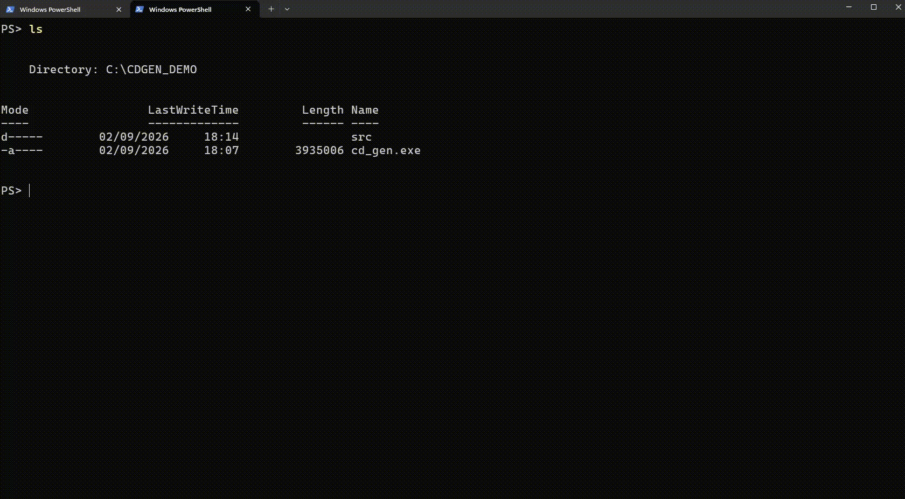
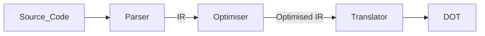

**CDGEN** is an easy-to-use, automatic class diagram generator tool for C++ projects. You provide CDGEN the root directory of your project, it recursively searches the directory for C++ source files and class/struct declarations, and translates them into the [DOT](https://graphviz.org/doc/info/lang.html) language defined by [Graphviz](https://graphviz.org/). You can use the translated Graphviz DOT file to produce your class diagram as an **.svg** file.



CDGEN aims to streamline the class diagram creation process by providing an automated tool to generate a functional, and accurate model of a project. The output DOT file is designed to be as legible as possible to the layman so that any errors, ambiguities, or mistakes can be easily resolved upon manual review. Most of the key C++ language features are accounted for currently - including but not limited to: templates, type qualifiers (const, virtual, override, etc.), structs, nested/inner classes, inheritance relations, raw pointers and references, constructors and destructors, operator overloading, namespaces, etc.

### Installation

**Requirements**
- A C++20 compiler (or later)
- [CMake](https://cmake.org/) 3.21 (or later)
- [Graphviz](https://graphviz.org/download/) (to render the output `.dot` file into an `.svg`)
- [Tree-sitter](https://github.com/tree-sitter/tree-sitter) and the [C++ grammar](https://github.com/tree-sitter/tree-sitter-cpp) (will be fetched automatically during building)

**Build from source**
```
git clone https://github.com/barrett-daniel/CDGEN.git
cd CDGEN
git submodule update --init --recursive
mkdir build
cd build
cmake ..
cmake --build . --config Release --target cdgen 
```
This produces the `cdgen` executable in the `build/Release` directory.

### Usage

Run CDGEN against your project's root source directory, specifying an output file:
```
./cdgen -i=<path/to/project> -o=<output_filename.dot>
```

Then render the DOT file into an SVG diagram using Graphviz:
```
dot -Tsvg <output_filename.dot> -o diagram.svg
```

**Required Program Arguments**


| Argument    | Description                               |
| ----------- | ----------------------------------------- |
| `-i=<PATH>` | Input directory to scan for source files  |
| `-o=<PATH>` | Output filename for the generated diagram |

**Optional Program Arguments** (default = `true`)


| Argument                              | Description                                                              |
| ------------------------------------- | ------------------------------------------------------------------------ |
| `-verbose_debug=<BOOL>`               | Print detailed debug output during generation                            |
| `-remove_undefined_types=<BOOL>`      | Omit types that could not be resolved                                    |
| `-display_functions_first=<BOOL>`     | List functions before fields in each class                               |
| `-hide_empty_diagram_sections=<BOOL>` | Hide function/field sections with no entries in the output               |
| `-show_members=<BOOL>`                | Show members of classes. Takes precedence over`-show_non_public_members` |
| `-show_non_public_members=<BOOL>`     | Show non-public members (private or protected)                           |

**Other Arguments**


| Argument | Description            |
| -------- | ---------------------- |
| `-help`  | Display a help message |

### Design Philosophy & Development Information

Inspired by Compiler design, CDGEN has 3 key components:

1. **Parser** - responsible for taking the source language code, and converting it into the defined [Intermediate Representation](/src/intermediate_representation.hpp)
2. **Optimiser** - performs cleanup on the global set of class information which can only be completed after one complete pass of the parser.
3. **Translator** - translates the [Intermediate Representation](/src/intermediate_representation.hpp) into the [DOT](https://graphviz.org/doc/info/lang.html) language, ready to compose a class diagram with [Graphviz](https://graphviz.org/).



As the translator and optimiser operate on the IR, to provide support for a new source language, only a new parser for said language must be implemented. This allows for easier extendability of the project in future. The C++ parser itself, is implement using the [Tree Sitter](https://github.com/tree-sitter/tree-sitter) C parsing API, and the [C++ Grammar](https://github.com/tree-sitter/tree-sitter-cpp)

Unit Tests are implemented using [Doctest](https://github.com/doctest/doctest) and cover the basic cases for all currently implemented features.
